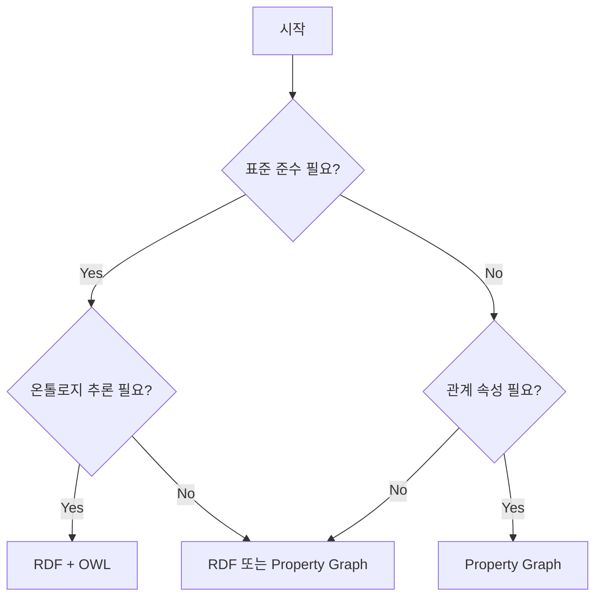

# 그래프 데이터 모델

## 개요

그래프 데이터 모델은 데이터를 **노드(Nodes)**와 **엣지(Edges)**로 표현하는 방식입니다. 지식 그래프에서 사용되는 두 가지 주요 모델이 있습니다.

## RDF (Resource Description Framework)

### 구조

RDF는 W3C 표준으로, 모든 것을 **트리플(Triple)**로 표현합니다:

```
Subject --Predicate--> Object
```

### 예시

```turtle
@prefix ex: <http://example.org/> .
@prefix foaf: <http://xmlns.com/foaf/0.1/> .

ex:홍길동 a foaf:Person ;
    foaf:name "홍길동" ;
    foaf:age 30 ;
    ex:worksAt ex:테크회사 .

ex:테크회사 a ex:Company ;
    ex:name "테크회사" ;
    ex:industry "IT" .
```

### 장점

- W3C 표준으로 상호운용성 보장
- 강력한 온톨로지 지원 (OWL)
- 연합 쿼리 (Federated Query) 가능

### 단점

- 관계에 속성을 직접 추가하기 어려움
- 학습 곡선이 가파름

## Property Graph

### 구조

Property Graph는 노드와 엣지 모두에 **속성(Properties)**을 가질 수 있습니다:

```
(Node {properties}) -[RELATIONSHIP {properties}]-> (Node {properties})
```

### 예시 (Cypher)

```cypher
CREATE (hong:Person {name: '홍길동', age: 30})
CREATE (tech:Company {name: '테크회사', industry: 'IT'})
CREATE (hong)-[:WORKS_AT {since: 2020, role: 'Engineer'}]->(tech)
```

### 장점

- 직관적이고 이해하기 쉬움
- 관계에 속성 추가 용이
- Neo4j 등 상용 DB의 네이티브 지원

### 단점

- 표준화 부족 (GQL 표준 진행 중)
- 온톨로지 지원 제한적

## 모델 비교

| 특성 | RDF | Property Graph |
|------|-----|----------------|
| **표준** | W3C | GQL (진행 중) |
| **기본 단위** | Triple | Node + Edge |
| **관계 속성** | Reification 필요 | 네이티브 지원 |
| **스키마** | RDFS/OWL | 유연한 레이블 |
| **쿼리 언어** | SPARQL | Cypher/Gremlin |
| **추론** | RDFS/OWL 추론 | 제한적 |

## 모델 선택 가이드



### RDF 선택 시

- 시맨틱 웹 애플리케이션
- 다양한 데이터 소스 통합
- 표준 온톨로지 활용 (FOAF, Dublin Core 등)
- 연합 쿼리 필요

### Property Graph 선택 시

- 소셜 네트워크 분석
- 추천 시스템
- 사기 탐지
- 실시간 그래프 분석

## 하이브리드 접근

두 모델의 장점을 결합할 수 있습니다:

```python
# RDF 온톨로지 정의 + Property Graph 저장
from rdflib import Graph, Namespace

# 1. RDF로 온톨로지 정의
ontology = Graph()
# ... 온톨로지 정의

# 2. Neo4j Property Graph로 인스턴스 저장
from neo4j import GraphDatabase

driver = GraphDatabase.driver("bolt://localhost:7687", auth=("neo4j", "password"))

with driver.session() as session:
    # RDF 온톨로지의 클래스를 Neo4j 레이블로 매핑
    session.run("""
        CREATE (p:Person:Agent {name: '홍길동'})
        CREATE (c:Company:Organization {name: '테크회사'})
        CREATE (p)-[:WORKS_AT {since: 2020}]->(c)
    """)
```

## 다음 단계

- [온톨로지와 스키마](ontology-schema.md)에서 스키마 설계를 학습하세요
- [SPARQL](../api/sparql.md)과 [Cypher](../api/cypher.md) 쿼리 언어를 비교하세요
