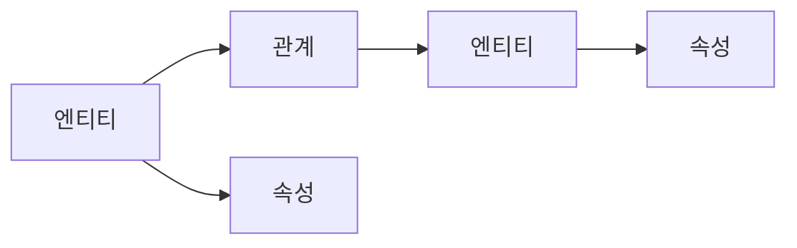

# 지식 그래프란?

## 정의

**지식 그래프(Knowledge Graph)**는 현실 세계의 엔티티(entities)와 그들 간의 관계(relationships)를 그래프 구조로 표현한 지식 베이스입니다.

> "Things, not strings" - Google Knowledge Graph (2012)

## 핵심 특징

### 1. 그래프 구조



- **노드(Node)**: 엔티티를 표현
- **엣지(Edge)**: 관계를 표현
- **속성(Property)**: 추가 정보

### 2. 시맨틱 표현

지식 그래프는 단순한 데이터 저장을 넘어 **의미론적 관계**를 표현합니다:

```
(서울) -[수도]-> (대한민국)     # 의미: 서울은 대한민국의 수도
(Python) -[프로그래밍언어]-> (소프트웨어)  # 의미: Python은 소프트웨어 개발용 언어
```

### 3. 연결된 데이터

고립된 데이터가 아닌 **연결된 네트워크**로서 가치를 창출:

```cypher
// 홍길동과 연결된 모든 엔티티 탐색
MATCH (p:Person {name: "홍길동"})-[r*1..3]-(connected)
RETURN p, r, connected
```

## 구성 요소

### 트리플 (Triple)

지식 그래프의 기본 단위:

```
(Subject) --[Predicate]--> (Object)
(주어)    --[술어]    --> (목적어)
```

예시:
| Subject | Predicate | Object |
|---------|-----------|--------|
| 아인슈타인 | 태어난곳 | 독일 |
| 상대성이론 | 발견자 | 아인슈타인 |
| 독일 | 대륙 | 유럽 |

### 온톨로지 (Ontology)

지식의 구조와 제약을 정의하는 스키마:

```turtle
# RDF/OWL 온톨로지 예시
@prefix ex: <http://example.org/> .
@prefix rdfs: <http://www.w3.org/2000/01/rdf-schema#> .

ex:Person a rdfs:Class .
ex:Company a rdfs:Class .
ex:worksAt a rdf:Property ;
    rdfs:domain ex:Person ;
    rdfs:range ex:Company .
```

## 지식 그래프 vs 다른 데이터 모델

| 특성 | 관계형 DB | 문서 DB | 지식 그래프 |
|------|----------|---------|------------|
| 스키마 | 고정 | 유연 | 매우 유연 |
| 관계 표현 | JOIN | 임베딩 | 네이티브 |
| 쿼리 복잡도 | JOIN 많으면 느림 | 제한적 | 관계 탐색 최적화 |
| 추론 | 불가 | 불가 | 가능 |

## 주요 지식 그래프

### 공개 지식 그래프

- **Wikidata**: 위키미디어 재단의 무료 지식 베이스
- **DBpedia**: 위키피디아에서 추출한 구조화된 데이터
- **Freebase**: Google이 인수한 대규모 지식 베이스

### 기업용 지식 그래프

- **Google Knowledge Graph**: 검색 결과 향상
- **Microsoft Academic Graph**: 학술 논문 네트워크
- **LinkedIn Knowledge Graph**: 직업, 기술 관계 모델링

## 활용 사례

```python
# 지식 그래프 기반 질의응답
def answer_question(kg, question):
    """
    질문: "아인슈타인이 태어난 나라의 수도는?"

    추론 경로:
    1. (아인슈타인)-[태어난곳]->(독일)
    2. (독일)-[수도]->(베를린)

    답: 베를린
    """
    # Cypher 쿼리로 변환
    query = """
    MATCH (person:Person {name: $name})-[:BORN_IN]->(country)
    MATCH (country)-[:CAPITAL]->(capital)
    RETURN capital.name
    """
    return kg.query(query, name="아인슈타인")
```

## 다음 단계

- [그래프 데이터 모델](graph-data-model.md)에서 모델링 방법을 학습하세요
- [온톨로지와 스키마](ontology-schema.md)에서 스키마 설계를 배우세요
