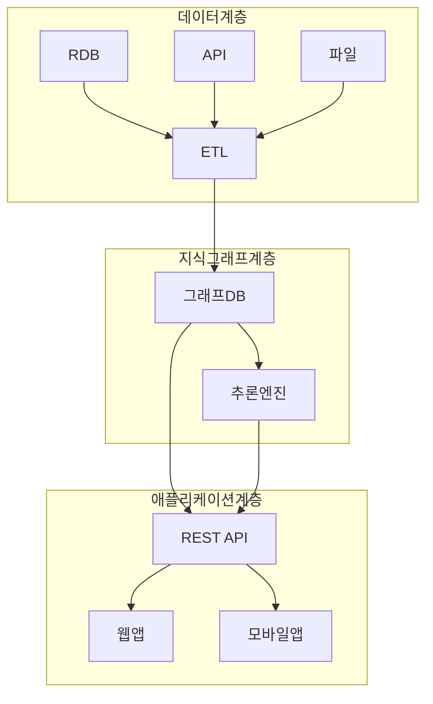

# 아키텍처 설계

## 시스템 구성



## 기술 스택

| 계층 | 기술 |
|------|------|
| 그래프 DB | Neo4j, Amazon Neptune |
| ETL | Apache Spark, Airflow |
| API | FastAPI, GraphQL |
| 프론트엔드 | React, D3.js |

## 확장성 설계

### 수평 확장

```yaml
# Neo4j 클러스터
services:
  neo4j-core:
    image: neo4j:enterprise
    environment:
      - NEO4J_MODE=CORE
    deploy:
      replicas: 3
```

### 캐싱

```python
from functools import lru_cache
import redis

redis_client = redis.Redis()

def cached_query(query_key, query_func):
    cached = redis_client.get(query_key)
    if cached:
        return json.loads(cached)
    result = query_func()
    redis_client.setex(query_key, 3600, json.dumps(result))
    return result
```

## 다음 단계

- [데이터 모델링](data-modeling.md)에서 스키마 설계를 학습하세요
