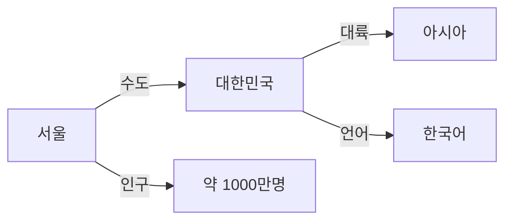

# Knowledge Graph 완벽 가이드

지식 그래프(Knowledge Graph)의 개념부터 실제 구현까지, 체계적으로 학습할 수 있는 완벽 가이드입니다.

## 지식 그래프란?

지식 그래프는 **실세계의 엔티티(개체)와 그들 간의 관계를 그래프 형태로 표현한 지식 베이스**입니다. 노드는 엔티티를, 엣지는 관계를 나타내며, 이를 통해 복잡한 도메인 지식을 구조화하고 추론할 수 있습니다.



## 왜 지식 그래프인가?

| 특징 | 설명 |
|------|------|
| **유연한 스키마** | 새로운 엔티티와 관계를 동적으로 추가 가능 |
| **의미론적 풍부함** | 데이터 간의 의미 있는 연결 표현 |
| **추론 능력** | 명시되지 않은 지식을 논리적으로 도출 |
| **통합 용이성** | 이질적인 데이터 소스를 하나로 통합 |

## 주요 활용 분야

<div class="grid cards" markdown>

-   :material-domain:{ .lg .middle } **기업 지식 관리**

    ---

    조직 내 분산된 지식을 통합하고 검색 가능하게 만들어 의사결정 지원

-   :material-star:{ .lg .middle } **추천 시스템**

    ---

    사용자-아이템 관계를 그래프로 모델링하여 정교한 추천 제공

-   :material-robot:{ .lg .middle } **AI/NLP 통합**

    ---

    LLM과 결합하여 환각(hallucination)을 줄이고 사실 기반 응답 생성

-   :material-chart-timeline:{ .lg .middle } **금융 분석**

    ---

    금융 네트워크 분석, 사기 탐지, 리스크 관리에 활용

</div>

## 빠른 시작

```python
from neo4j import GraphDatabase

# Neo4j 연결
driver = GraphDatabase.driver("bolt://localhost:7687",
                              auth=("neo4j", "password"))

# 노드 생성
with driver.session() as session:
    session.run("""
        CREATE (p:Person {name: '홍길동', age: 30})
        CREATE (c:Company {name: '테크회사'})
        CREATE (p)-[:WORKS_AT {since: 2020}]->(c)
    """)
```

## 문서 구성

1. **[시작하기](getting-started/introduction.md)** - 지식 그래프 기초 개념
2. **[핵심 개념](concepts/what-is-kg.md)** - 그래프 모델, 온톨로지, 추론
3. **[활용 사례](use-cases/enterprise-knowledge.md)** - 실제 산업별 적용 사례
4. **[구현 가이드](implementation/architecture.md)** - 설계부터 배포까지
5. **[API 레퍼런스](api/sparql.md)** - SPARQL, Cypher, GraphQL
6. **[고급 주제](advanced/graph-embedding.md)** - 임베딩, LLM 통합

---

!!! tip "시작하기"
    지식 그래프가 처음이라면 [소개](getting-started/introduction.md) 페이지부터 시작하세요.
