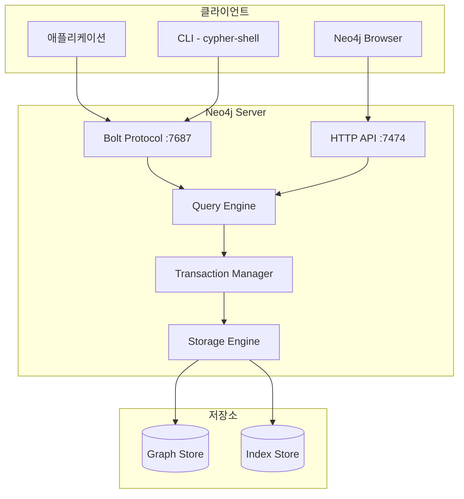

# Neo4j 소개

## Neo4j란?

**Neo4j**는 세계에서 가장 널리 사용되는 **네이티브 그래프 데이터베이스**입니다. 2007년에 처음 출시되어, 현재 Fortune 500 기업의 75% 이상이 사용하고 있습니다.

## 왜 Neo4j인가?

### 기존 데이터베이스의 한계

```
관계형 DB에서 "친구의 친구의 친구" 찾기:

SELECT DISTINCT f3.*
FROM users u
JOIN friendships f1 ON u.id = f1.user_id
JOIN users friend1 ON f1.friend_id = friend1.id
JOIN friendships f2 ON friend1.id = f2.user_id
JOIN users friend2 ON f2.friend_id = friend2.id
JOIN friendships f3_rel ON friend2.id = f3_rel.user_id
JOIN users f3 ON f3_rel.friend_id = f3.id
WHERE u.name = '홍길동'
  AND f3.id NOT IN (SELECT friend_id FROM friendships WHERE user_id = u.id)
  AND f3.id != u.id;
```

### Neo4j의 간결함

```cypher
// 동일한 쿼리를 Neo4j에서
MATCH (u:User {name: '홍길동'})-[:FRIEND*3]-(fof)
WHERE NOT (u)-[:FRIEND]-(fof) AND u <> fof
RETURN DISTINCT fof
```

## 핵심 특징

### 1. 네이티브 그래프 저장

```
┌─────────────────────────────────────────────┐
│           Neo4j 저장 구조                    │
├─────────────────────────────────────────────┤
│  Node Store     → 노드 데이터               │
│  Relationship   → 관계 데이터 (양방향 연결)  │
│  Property Store → 속성 데이터               │
│  Label Store    → 레이블 인덱스             │
└─────────────────────────────────────────────┘
```

- **Index-free Adjacency**: 각 노드가 이웃 노드에 대한 직접 포인터 보유
- 관계 탐색 시간: O(1) - 데이터 크기와 무관

### 2. ACID 트랜잭션

```cypher
// 트랜잭션 내에서 원자적 실행
:BEGIN
CREATE (a:Account {id: 'A', balance: 1000})
CREATE (b:Account {id: 'B', balance: 500})
CREATE (a)-[:TRANSFER {amount: 200}]->(b)
SET a.balance = a.balance - 200
SET b.balance = b.balance + 200
:COMMIT
```

### 3. 유연한 스키마

```cypher
// 동적으로 속성과 레이블 추가 가능
CREATE (p:Person {name: '홍길동'})
SET p:Employee:Manager  // 레이블 추가
SET p.department = '개발팀'  // 속성 추가
SET p.skills = ['Python', 'Neo4j']  // 배열 속성
```

### 4. 강력한 쿼리 언어 - Cypher

```cypher
// 선언적이고 직관적인 패턴 매칭
MATCH (movie:Movie)<-[:ACTED_IN]-(actor:Person)-[:DIRECTED]->(directed:Movie)
WHERE movie.title = 'The Matrix'
RETURN actor.name, collect(directed.title) AS directedMovies
```

## Neo4j 에디션 비교

| 기능 | Community | Enterprise |
|------|-----------|------------|
| 가격 | 무료 (GPL) | 유료 라이선스 |
| 클러스터링 | ❌ | ✅ Causal Clustering |
| 롤 기반 접근제어 | 기본 | 세분화된 RBAC |
| 온라인 백업 | ❌ | ✅ |
| 다중 데이터베이스 | ❌ | ✅ |
| 성능 모니터링 | 기본 | 고급 메트릭 |

## 아키텍처 개요



## 사용 사례

### 1. 소셜 네트워크
- Facebook, LinkedIn의 친구 추천
- 인플루언서 분석

### 2. 추천 엔진
- Netflix, Amazon의 개인화 추천
- 실시간 추천

### 3. 사기 탐지
- 금융 거래 네트워크 분석
- 보험 사기 패턴 탐지

### 4. 네트워크/IT 운영
- 인프라 의존성 매핑
- 장애 영향도 분석

### 5. 지식 그래프
- 기업 지식 관리
- AI/LLM 그라운딩

## 학습 로드맵


## 시작하기

!!! tip "다음 단계"
    [설치 및 설정](installation.md) 페이지에서 Neo4j를 설치하고 첫 그래프를 만들어보세요.

## 유용한 리소스

- [Neo4j 공식 문서](https://neo4j.com/docs/)
- [Neo4j GraphAcademy](https://graphacademy.neo4j.com/) - 무료 온라인 강좌
- [Neo4j Community](https://community.neo4j.com/) - 커뮤니티 포럼
- [Neo4j GitHub](https://github.com/neo4j/neo4j)
