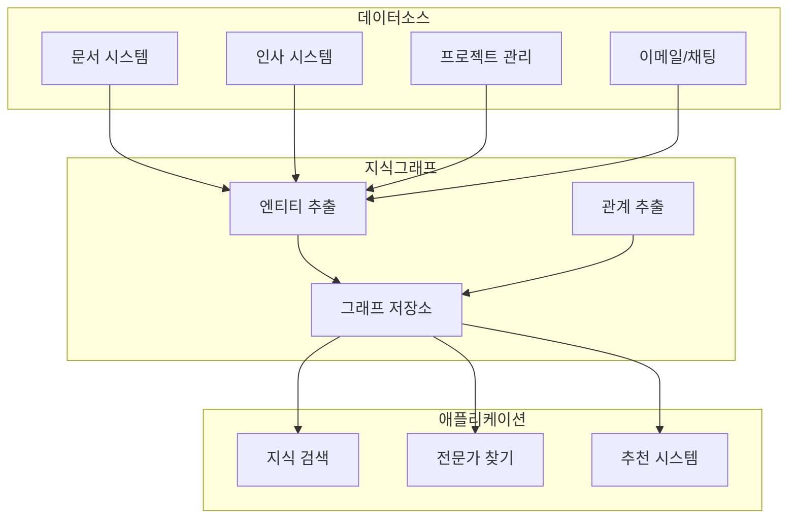

# 기업 지식 관리

## 개요

기업 지식 그래프는 조직 내 분산된 지식을 통합하고 검색 가능하게 만들어 의사결정을 지원합니다.

## 핵심 가치

| 영역 | 기존 방식 | 지식 그래프 |
|------|----------|------------|
| 지식 검색 | 키워드 기반 | 의미 기반 검색 |
| 전문가 찾기 | 수동 네트워킹 | 자동 전문성 매핑 |
| 온보딩 | 문서 기반 학습 | 맥락화된 학습 경로 |
| 의사결정 | 경험 의존 | 데이터 기반 인사이트 |

## 아키텍처



## 스키마 설계

```cypher
// 핵심 노드 타입
CREATE (p:Person {
  id: 'emp001',
  name: '홍길동',
  email: 'hong@company.com',
  department: '개발팀',
  joinDate: date('2020-01-15')
})

CREATE (s:Skill {name: 'Python', category: 'Programming'})
CREATE (proj:Project {name: 'AI 플랫폼', status: 'active'})
CREATE (doc:Document {title: '시스템 설계서', type: 'technical'})
CREATE (topic:Topic {name: '머신러닝'})

// 관계 정의
CREATE (p)-[:HAS_SKILL {level: 'expert', since: 2018}]->(s)
CREATE (p)-[:WORKS_ON {role: 'lead'}]->(proj)
CREATE (p)-[:AUTHORED]->(doc)
CREATE (doc)-[:ABOUT]->(topic)
CREATE (s)-[:RELATED_TO]->(topic)
```

## 주요 기능 구현

### 1. 전문가 찾기

```cypher
// 특정 주제 전문가 검색
MATCH (topic:Topic {name: '머신러닝'})
MATCH (person:Person)-[:HAS_SKILL]->(skill)-[:RELATED_TO]->(topic)
WITH person, count(skill) AS relevance
ORDER BY relevance DESC
RETURN person.name, person.department, relevance
LIMIT 10
```

### 2. 지식 경로 탐색

```cypher
// 두 개념 간의 연결 경로
MATCH path = shortestPath(
  (start:Topic {name: 'Python'})-[*]-(end:Topic {name: 'MLOps'})
)
RETURN path
```

### 3. 프로젝트 인사이트

```cypher
// 프로젝트에 필요한 기술과 보유 인력
MATCH (proj:Project {name: 'AI 플랫폼'})-[:REQUIRES]->(skill:Skill)
OPTIONAL MATCH (person:Person)-[r:HAS_SKILL]->(skill)
WHERE r.level IN ['expert', 'advanced']
RETURN skill.name,
       collect(person.name) AS experts,
       CASE WHEN size(collect(person)) = 0 THEN 'GAP' ELSE 'OK' END AS status
```

## Python 구현 예시

```python
from neo4j import GraphDatabase

class EnterpriseKG:
    def __init__(self, uri, user, password):
        self.driver = GraphDatabase.driver(uri, auth=(user, password))

    def find_experts(self, topic: str, limit: int = 10):
        """특정 주제 전문가 검색"""
        query = """
        MATCH (t:Topic {name: $topic})
        MATCH (p:Person)-[hs:HAS_SKILL]->(s:Skill)-[:RELATED_TO]->(t)
        WITH p, sum(CASE hs.level
            WHEN 'expert' THEN 3
            WHEN 'advanced' THEN 2
            ELSE 1 END) AS score
        ORDER BY score DESC
        LIMIT $limit
        RETURN p.name AS name, p.department AS dept, score
        """
        with self.driver.session() as session:
            result = session.run(query, topic=topic, limit=limit)
            return [dict(record) for record in result]

    def get_knowledge_path(self, from_topic: str, to_topic: str):
        """두 주제 간 지식 경로"""
        query = """
        MATCH path = shortestPath(
            (start:Topic {name: $from})-[*..5]-(end:Topic {name: $to})
        )
        RETURN [n in nodes(path) | n.name] AS path
        """
        with self.driver.session() as session:
            result = session.run(query, {"from": from_topic, "to": to_topic})
            record = result.single()
            return record["path"] if record else None

# 사용 예시
kg = EnterpriseKG("bolt://localhost:7687", "neo4j", "password")
experts = kg.find_experts("머신러닝")
print("ML 전문가:", experts)
```

## 성과 지표

- **검색 시간 단축**: 평균 70% 감소
- **전문가 찾기**: 수일 → 수분
- **온보딩 기간**: 30% 단축
- **중복 작업 감소**: 40% 개선

## 다음 단계

- [추천 시스템](recommendation-system.md)에서 개인화 추천을 학습하세요
- [NLP 통합](nlp-integration.md)에서 자동 지식 추출을 확인하세요
